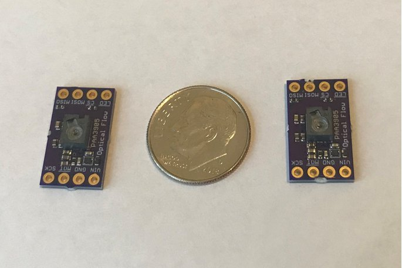

# PAA3905
Header-only Arduino library for the
[PAA3905 optical flow camera](https://www.tindie.com/products/onehorse/paa3905-optical-flow-camera/)

The sensor uses standard SPI for communications at a maximum serial port
speed of 2 MHz. The sensor data ready is signaled by an active LOW
interrupt.

This sensor offers two sensitivities: standard detection and enhanced
detection for rough terrain at > 15 cm height. The sensor can automatically
switch between bright (>60 lux), low light (>30 lux), and super low light (> 5
lux) conditions. Bright and low light modes work at 126 frames per second. The
super low light mode is limited to 50 frames per second.

The sensor uses typically 3.5 mA in operation and has a 12 uA shutdown mode.

The sensor can operate in navigate mode producing delta X and Y values which
are proportional to lateral velocity.  The limiting speed is determined by the
maximum 7.2 rads/sec flow rate and by distance to the measurement surface; 80
mm is the minimum measurement distance. So at 80 mm the maxium speed is 0.576
m/s (1.25 mph), at 2 meter distance (~drone height) the maximum speed is 14.4
m/s (32 mph), etc.

The sensor can also operate in raw data (frame grab) mode producing 35 x 35
pixel images from the sensor at a frame rate of ~15 Hz. This makes the PAA3905
an inexpensive, low-resolution, infrared-sensitive video camera.

This code is based on Kris Winer's PAA3905
[sketches](https://github.com/kriswiner/PAA3905).  As usual, I took Kris's code
an made an Arduino library that you can clone into your Arduino/libraries
folder to run examples and use for other projects.

I have tested this library on the following platforms:

* Teensy 4.0 from PJRC

* Ladybug STM32L4 from Tlera Corporation

* TinyPICO ESP32
